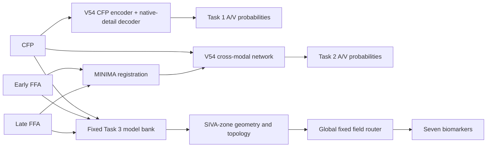

<div align="center">

# GAVE2 Challenge 2026 — 8th-Place Solution

**Retinal artery/vein segmentation and vascular biomarker quantification from CFP and FFA**

[English](README.md) | [简体中文](README_zh-CN.md)

[](https://www.python.org/)
[](https://pytorch.org/)
[](https://aistudio.baidu.com/competition/detail/1463/0/introduction)

</div>

This repository contains the training and inference code for our **8th-place
preliminary-round solution** to the MICCAI 2026 GAVE2 Challenge. The code
reproduces our best submitted system, **TJ009**, covering all three tasks:

1. CFP-only retinal artery/vein segmentation;
2. CFP + FFA cross-modal artery/vein segmentation;
3. CRAE, CRVE, AVR, artery/vein density, and artery/vein fractal dimension.

> The challenge is still in progress. The rank in the repository title is the
> preliminary rank at the time of release and may be updated after the final
> round.

## News

- **2026-08**: Initial private code release with complete training and inference
  pipelines. Model weights will be published separately after the competition.

## Preliminary results

Our best valid online submission is **TJ009**.

| Submission | Task 1 | Task 2 | Task 3 | Overall |
|---|---:|---:|---:|---:|
| TJ009 | 8.29660 | 8.31706 | 7.39370 | **7.94362** |

The overall score is computed by the organizer as
`0.2 × Task1 + 0.4 × Task2 + 0.4 × Task3`. The repository does not contain
competition images, annotations, predictions, or checkpoints.

## Method overview



### Task 1 and Task 2: GAVEV54

- ConvNeXt-Tiny multi-scale CFP encoder;
- U-Net-like decoder with a native-resolution detail stem;
- semantic, generic-vessel, and class-centerline heads;
- five shared probability-space recursive refinement steps;
- artery/vein topology-aware training losses;
- CFP-only optical-density detail features for Task 1;
- gated multi-scale fusion of registered early/late FFA for Task 2.

Task 1 is **strictly CFP-only**. Neither training nor inference reads FFA for
Task 1.

### Task 3: fixed-field geometry system

Task 3 is not a black-box scalar regressor. We first extract biomarkers from
segmentation probabilities using SIVA-style geometry and then apply one global,
case-independent field route:

| Biomarker | Frozen source |
|---|---|
| CRAE, CRVE, AVR | V2 Task 2, original unregistered FFA |
| artery density | V3 Task 2 + global OOF calibration, original FFA |
| vein density | D0044 low-capacity C-zone refiner, registered FFA |
| artery fractal dimension | deterministic branch consistency over V2 maps |
| vein fractal dimension | V12 registered-FFA estimates averaged at thresholds 0.4/0.5/0.6 |

No labels, leaderboard feedback, or per-case model selection are used at
inference time. See [the architecture document](docs/MODEL_ARCHITECTURE.md) and
the machine-readable [TJ009 route](configs/tj009_route.json).

## Repository layout

```text
.
├── README.md / README_zh-CN.md
├── code/
│   ├── run_tj009_inference.sh       # end-to-end inference and packaging
│   ├── assemble_tj009_task3.py      # exact seven-field Task 3 router
│   ├── biomarker_tools/             # optic-disc and biomarker geometry
│   ├── external/MINIMA/             # Apache-2.0 MINIMA source snapshot
│   └── gave2_solution/              # models, training, prediction, postprocess
├── configs/
│   ├── training/                    # released training configurations
│   ├── tj009_route.json
│   ├── v3_density_calibration.json
│   └── weights_manifest.json
├── docs/
├── weights/                         # intentionally empty; expected paths only
├── environment.yml
└── requirements.txt
```

## Installation

The verified training/inference machine used Python 3.11, PyTorch 2.4.0,
CUDA 12.1, and an RTX 4090.

```bash
git clone git@github.com:KawhiQaQ/GAVE2-Challenge-8th-Solution.git
cd GAVE2-Challenge-8th-Solution

conda env create -f environment.yml
conda activate gave2
export PYTHONPATH="$PWD/code/gave2_solution"
```

Alternatively, install PyTorch for your CUDA version first and then run:

```bash
pip install -r requirements.txt
```

## Dataset preparation

Download the GAVE2 data from the official challenge page and organize it as
follows. The code never downloads or redistributes challenge data.

```text
GAVE2_preliminary/
├── training/
│   ├── images/g_xxx.png
│   ├── masks/g_xxx.png
│   ├── av/g_xxx.png
│   ├── FFA_A/g_xxx.png
│   ├── FFA_AV/g_xxx.png
│   └── biomarker/g_xxx.txt
└── validation/
    ├── images/g_xxx.png
    ├── masks/g_xxx.png
    ├── FFA_A/g_xxx.png
    └── FFA_AV/g_xxx.png
```

`masks/` denotes the released retinal field-of-view mask, while `av/` denotes
the RGB artery/vessel/vein annotation. Images are expected at the official
1536×1024 resolution.

## Checkpoints

Checkpoints are intentionally excluded from Git. A Baidu Netdisk link will be
added after the competition. After downloading the bundle, place files exactly
as described in [weights/README.md](weights/README.md). Every expected file and
SHA256 digest is recorded in
[configs/weights_manifest.json](configs/weights_manifest.json).

The external MINIMA checkpoint can also be downloaded from its
[official release](https://github.com/LSXI7/storage/releases/download/MINIMA/minima_loftr.ckpt).

## Reproduce TJ009 inference

Once the dataset and checkpoints are in place, run:

```bash
bash code/run_tj009_inference.sh \
  --data-root /absolute/path/GAVE2_private \
  --work-root /absolute/path/tj009_work \
  --output-zip /absolute/path/kawhi00.zip \
  --python "$(which python)" \
  --device cuda
```

The input root must contain
`validation/{images,masks,FFA_A,FFA_AV}`. Case IDs must form one contiguous
`g_###` interval. The script performs:

1. independent early/late FFA-to-CFP registration with MINIMA-LoFTR;
2. optic-disc detection and SIVA C-zone construction;
3. V54 Task 1 and Task 2 inference;
4. V2/V3/V12/D0044 Task 3 inference;
5. deterministic biomarker extraction and fixed-field assembly;
6. threshold-preserving probability compaction;
7. submission validation and ZIP packaging.

The result contains exactly:

```text
Task1/g_xxx.png  # RGB = artery, all vessel, vein probabilities
Task2/g_xxx.png  # RGB = artery, all vessel, vein probabilities
Task3/g_xxx.txt  # seven biomarker values
```

The runner refuses to overwrite an existing work directory or output ZIP. If
you already have audited registration/disc/zone caches, see
[`code/run_tj009_inference.sh --help`](code/run_tj009_inference.sh) for the
optional cache arguments.

## Training

The following commands expose both cross-validation and full-data training.
They are the actual entry points used by the released system; paths may be
changed, but the hyperparameters should remain fixed for exact reproduction.

### 1. Train the V1 initialization checkpoints

The official TJ009 full models were warm-started from their corresponding V1
Fold-0 checkpoints. Train Fold 0 as follows (use folds 0–4 for full CV):

```bash
export DATA=/absolute/path/GAVE2_preliminary
export RUNS=$PWD/runs

python code/gave2_solution/train.py \
  --task 1 --fold 0 --n-folds 5 --data-root "$DATA" \
  --output-dir "$RUNS/init/task1/fold0" \
  --size 768x1152 --epochs 80 --patience 15 --seed 77 --device cuda

python code/gave2_solution/train.py \
  --task 2 --fold 0 --n-folds 5 --data-root "$DATA" \
  --output-dir "$RUNS/init/task2/fold0" \
  --size 768x1152 --epochs 80 --patience 15 --seed 77 --device cuda
```

### 2. Register FFA for Task 2

```bash
export REGISTERED=$PWD/cache/registered_ffa

python code/gave2_solution/register_ffa_minima.py \
  --data-root "$DATA" \
  --output-root "$REGISTERED" \
  --minima-root code/external/MINIMA \
  --checkpoint weights/external/minima_loftr.ckpt \
  --splits training validation
```

Review the generated QA images and `registration_manifest.json` before
training. Registration uses no vessel or biomarker labels.

### 3. Train the final Task 1 and Task 2 models

```bash
python code/gave2_solution/train_full_variant.py \
  --variant v54 --task 1 --data-root "$DATA" \
  --output-dir "$RUNS/tj009/task1" \
  --init-checkpoint "$RUNS/init/task1/fold0/best.pt" \
  --epochs 48 --size 1024x1536 --batch-size 1 \
  --accumulation-steps 2 --learning-rate 1.5e-4 \
  --encoder-lr-ratio 0.10 --weight-decay 1e-4 \
  --warmup-epochs 2 --freeze-encoder-epochs 1 \
  --ema-decay 0.995 --r2-steps 5 --hard-gap-weight 0.25 \
  --seed 77 --device cuda --num-workers 0

python code/gave2_solution/train_full_variant.py \
  --variant v54 --task 2 --data-root "$DATA" --ffa-root "$REGISTERED" \
  --output-dir "$RUNS/tj009/task2" \
  --init-checkpoint "$RUNS/init/task2/fold0/best.pt" \
  --epochs 37 --size 1024x1536 --batch-size 1 \
  --accumulation-steps 2 --learning-rate 1.5e-4 \
  --encoder-lr-ratio 0.10 --weight-decay 1e-4 \
  --warmup-epochs 2 --freeze-encoder-epochs 1 \
  --ema-decay 0.995 --r2-steps 5 --hard-gap-weight 0.25 \
  --seed 77 --device cuda --num-workers 0
```

This corresponds to 1,200 optimizer updates for Task 1 and 925 for Task 2.

### 4. Train the Task 3 sources

Task 3 needs several globally frozen sources rather than a single checkpoint.
The exact commands and their modality choices are documented in
[Task 3 training](docs/TRAINING.md#task-3-source-training). In brief:

- V2 and V3 use original, unregistered FFA;
- V8 and V12 use MINIMA-registered FFA;
- D0044 freezes V8 and trains only a low-capacity C-zone vein refiner;
- the density calibration in `configs/v3_density_calibration.json` is fixed from
  out-of-fold training predictions and must not be refit on test data.

## Evaluation and submission rules

For labeled local predictions, reproduce the released A/V metrics with:

```bash
python code/gave2_solution/evaluate_av.py \
  --predictions-dir /path/to/probability_pngs \
  --labels-dir "$DATA/training/av" \
  --masks-dir "$DATA/training/masks" \
  --output /path/to/metrics.json
```

For Task 3, `local_biomarker_eval.py` reports raw MAE and SMAPE on labeled
training folds. The organizer's hidden P/Q normalization is not guessed by the
local evaluator.

- Task 1 must never access FFA.
- Task 1/2 PNG channels are `[artery, all vessel, vein]`.
- Task 3 always uses the same field route for every case.
- No test labels or per-case leaderboard-driven selection are used.
- Do not refit calibration factors on validation/private-test images.
- The submission ZIP contains `Task1/`, `Task2/`, and `Task3/` directly, with
  no extra team-name directory inside the archive.

## Third-party code

The repository includes an unmodified source snapshot of
[MINIMA](https://github.com/LSXI7/MINIMA) for reproducible FFA registration;
its Apache-2.0 license is retained. The optic-disc weight originates from
MNet/DeepCDR and is not redistributed here. See
[THIRD_PARTY_NOTICES.md](THIRD_PARTY_NOTICES.md).

## Citation

Our challenge report citation will be added after publication. If this code is
useful, please also cite the GAVE2 challenge and the upstream methods listed in
[THIRD_PARTY_NOTICES.md](THIRD_PARTY_NOTICES.md).

## License

The repository is private during the competition. A license for our original
code will be added before public release; bundled third-party code remains
under its original license.
